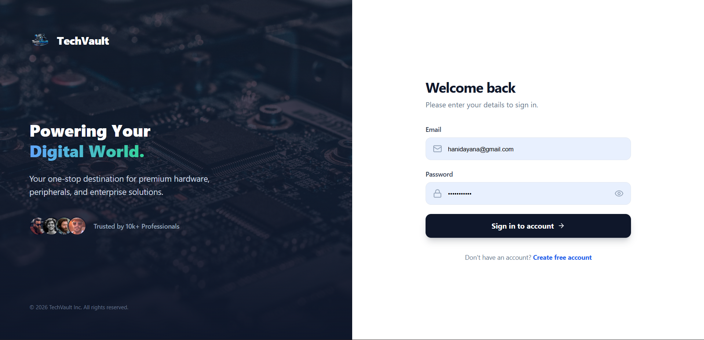
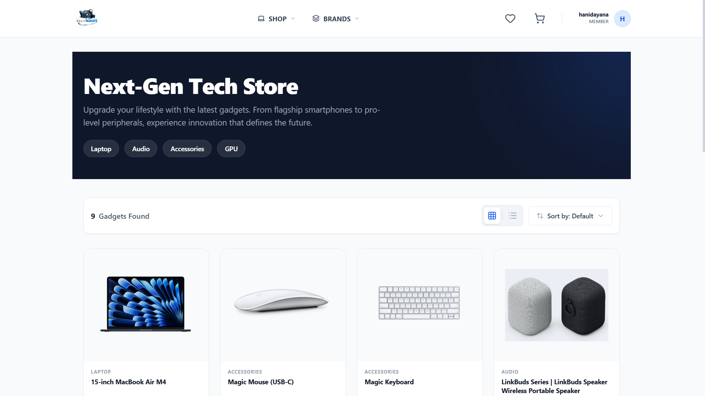
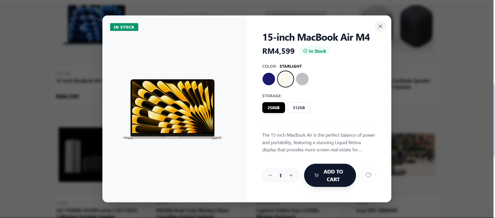
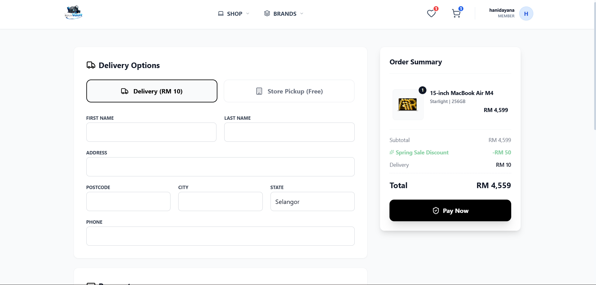
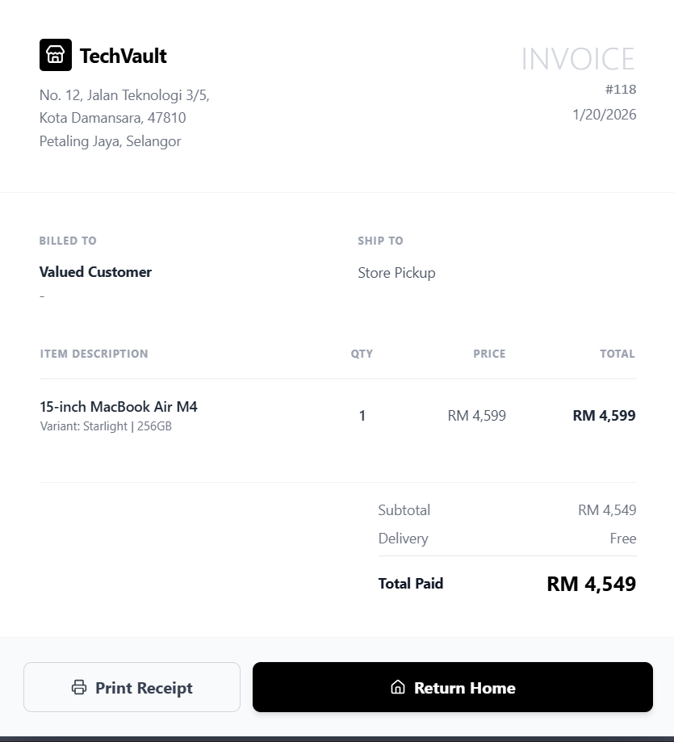
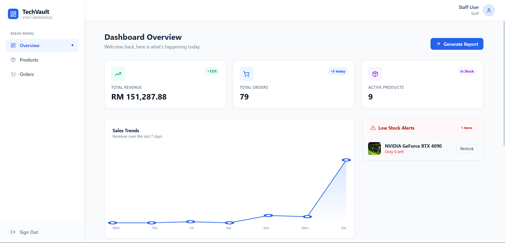
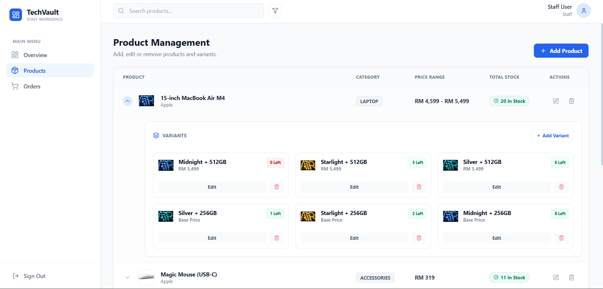

# 🛡️ TechVault | Enterprise Inventory & E-Commerce System


> **A full-stack, robust solution bridging the gap between complex backend inventory management and a modern, responsive customer e-commerce storefront.**

---

## 📖 Project Overview

**TechVault** is a comprehensive application designed to simulate a real-world electronics retail ecosystem. It solves two distinct problems: **Inventory Control** for administrators and **Seamless Shopping** for customers.

Built with a **Spring Boot** backend and **React** frontend, this project demonstrates proficiency in handling complex data relationships (dynamic product variants), secure authentication flows, and state management.

---

## 🚀 Key Technical Features

### 🔐 Security & Authentication
* **JWT Authentication:** Stateless, secure authentication using JSON Web Tokens.
* **RBAC (Role-Based Access Control):** distinct access levels for `ADMIN`, `STAFF`, and `CUSTOMER`.
* **Protected Routes:** React Router guards ensure users cannot access unauthorized pages.

### 📦 Advanced Inventory Management
* **Dynamic Variants:** Support for multi-dimensional product attributes (e.g., *Color* + *Storage*).
* **Smart Stock Deduction:** Logic to deduct stock from specific SKU variants upon checkout, not just the generic product.
* **Status Tracking:** Real-time order status updates (Pending → Shipped → Completed).

### 🛒 E-Commerce Experience
* **Persistent Cart:** Cart state management using React Context API.
* **Checkout Simulation:** Integrated payment gateway UI simulation (Card & FPX) with form validation.
* **Invoice Generation:** Auto-generated, printable digital receipts upon successful order placement.

---

## 📸 Visual Showcase

### 1. User Experience (Storefront)
*A modern, responsive shopping experience with filtering, sorting, and dynamic interactions.*

<table width="100%">
  <tr>
    <th width="50%">Secure Login & Registration</th>
    <th width="50%">Product Catalog & Filtering</th>
  </tr>
  <tr>
    <td></td>
    <td></td>
  </tr>
  <tr>
    <td colspan="2" align="center"><strong>Dynamic Product Details (Color/Storage Selection)</strong></td>
  </tr>
  <tr>
    <td colspan="2"></td>
  </tr>
</table>

### 2. The Checkout Flow
*A seamless transition from cart to payment to invoice.*

<table width="100%">
  <tr>
    <th width="50%">Secure Checkout Form</th>
    <th width="50%">Generated Digital Invoice</th>
  </tr>
  <tr>
    <td></td>
    <td></td>
  </tr>
</table>

### 3. Admin Workspace
*Powerful tools for staff to manage stock levels and process orders.*

<table width="100%">
  <tr>
    <th width="50%">Dashboard Overview</th>
    <th width="50%">Product & Variant Management</th>
  </tr>
  <tr>
    <td></td>
    <td></td>
  </tr>
</table>

---

## 🛠️ Technology Stack

### Backend (Java)
* **Framework:** Spring Boot 3.x
* **Security:** Spring Security 6, JWT (JJWT)
* **Data:** Spring Data JPA, Hibernate
* **Database:** PostgreSQL
* **API:** RESTful endpoints with DTO mapping

### Frontend (JavaScript)
* **Library:** React 18 (Vite)
* **Styling:** Tailwind CSS
* **State Management:** React Context API (Cart/Auth)
* **HTTP Client:** Axios with Interceptors (Auto-attach Tokens)
* **Icons:** Lucide React

---

## ⚙️ Installation & Setup

### Prerequisites
* Java JDK 17+
* Node.js & npm
* PostgreSQL

### 1. Clone the Repository
```bash
git clone [https://github.com/ynadyana/inventory-order-system.git](https://github.com/ynadyana/inventory-order-system.git)
cd inventory-order-system
